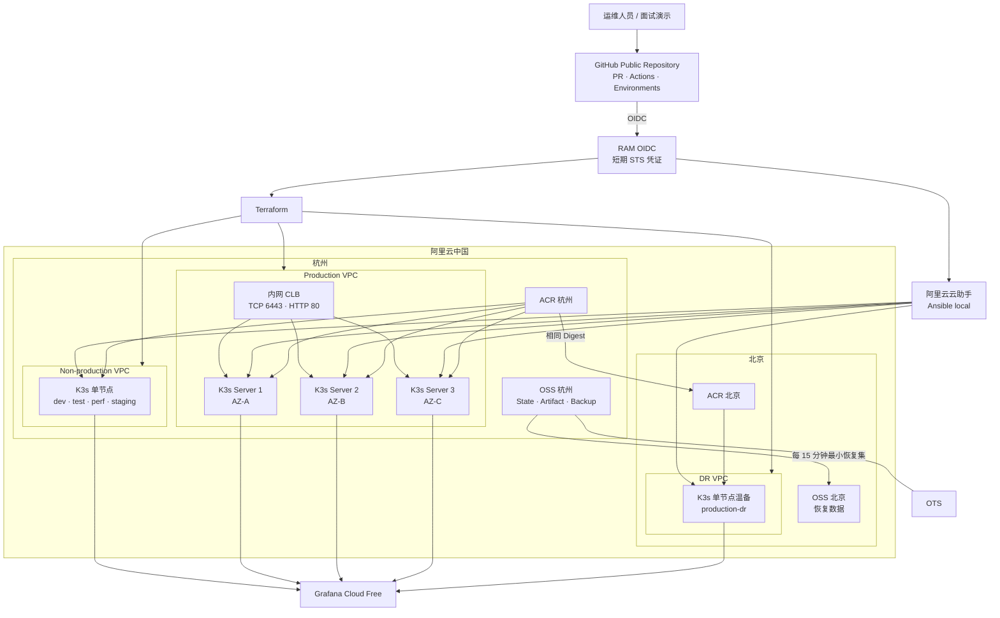
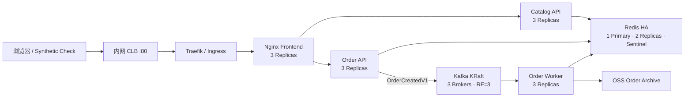
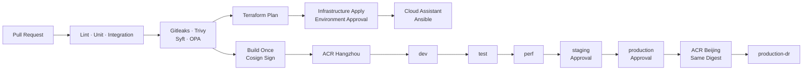
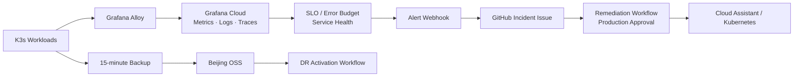

# GitHub + 阿里云中国 Distributed System 实施计划

> 状态：计划已保存，尚未执行。所有执行项均为未完成（`[ ]`）。
>执行过程中，任务状态要更新同步到docs/PLAN - General.md
> 验收基准：`/Users/xxseehome/Documents/sr-platform-engineer-test.pdf`

## 1. 总体方案与架构图

基于测试文档全部必选要求，以 GitHub 和阿里云中国替代无法使用的 GitLab 与 AWS.cn：

- [ ] GitHub Public Repository、Pull Request、Actions、Environments 替代 GitLab。
- [ ] 阿里云中国 VPC、ECS、CLB、ACR、OSS、RAM OIDC、云助手替代 AWS。
- [ ] 部署三个 K3s 集群：杭州 non-production、杭州 production、北京 DR。
- [ ] Production 使用三个跨可用区 K3s server，实现 control plane 和工作负载 HA。
- [ ] Flux 管理平台层，Argo CD 管理应用层；通过中国境内 ACR 分发 OCI GitOps artifact。
- [ ] Grafana Cloud Free 实现 metrics、logs、traces、SLO 和告警。
- [ ] Splunk ITSI/SOAR 只做能力映射，不宣称实际部署。
- [ ] 演示默认运行 4 小时、最多 8 小时；未抵扣费用硬上限 ¥50。

### 云平台与三集群架构

### 应用运行架构

### CI/CD、GitOps 与环境推广

### 可观测性、事件响应与 DR

- [ ] 将上述 Mermaid 图同步保存到 `docs/architecture.md`。
- [ ] 将架构图导出为 PNG，保存到 `docs/evidence/`。
-
## 2. 应用、基础设施与 GitOps 实施

### 应用接口

- [ ] 实现 `GET /healthz`，仅检查进程状态。
- [ ] 实现 `GET /readyz`，检查 Redis 和 Kafka 依赖。
- [ ] 实现 `GET /api/catalog`，返回演示商品。
- [ ] 实现 `POST /api/orders`，要求 `Idempotency-Key`，返回 HTTP 202 和 `order_id`。
- [ ] 实现 `GET /api/orders/{order_id}`，返回 `pending|processing|completed|failed`。
- [ ] 固定 Kafka `OrderCreatedV1`：`event_id`、`order_id`、`occurred_at`、`items[]`、`trace_id`、`schema_version=1`。
- [ ] 以 `order_id` 作为 Kafka message key，并以 `event_id` 去重。

### 三集群配置

| 集群 | 初始规模 | 配置 |
|---|---:|---|
| non-production | 1 × 4 vCPU/8 GB | 四个 namespace；共享单实例 Redis/Kafka，通过 topic、consumer group 和 key prefix 隔离 |
| production | 3 × 2 vCPU/4 GB，三个 AZ | 三 K3s server、embedded etcd、三副本应用、Kafka KRaft、Redis Sentinel |
| DR | 1 × 2 vCPU/4 GB | 温备 K3s、相同镜像和 GitOps artifact、按工作流恢复 |

- [ ] 使用 Ubuntu 22.04、40 GB 系统盘和按流量公网出口。
- [ ] 安全组禁止公网入站；优先使用 ACR/OSS 内网 endpoint。
- [ ] Production 工作负载使用三副本、Pod anti-affinity、topology spread、PDB。
- [ ] 设置 `maxUnavailable: 0`、`maxSurge: 1`、startup/readiness/liveness probes。
- [ ] 所有容器使用非 root、只读 root filesystem 和资源 requests/limits。
- [ ] Kafka 使用 RF=3、`min.insync.replicas=2`。
- [ ] Redis 使用一主两从和三个 Sentinel。
- [ ] 使用一个内网 CLB 提供 `TCP/6443` 和 `HTTP/80`。
- [ ] 默认通过 Workbench、云助手 synthetic check 和临时安全隧道验收，不创建长期公网入口。

### GitHub 与阿里云操作

- [ ] 创建公开 monorepo `xxseehome/distributed-system-platform`。
- [ ] 配置 `main` 分支 PR、required checks、禁止 force push 和管理员绕过。
- [ ] 创建 GitHub Environments：`infrastructure-plan`、`infrastructure-apply`、`staging`、`production`、`dr-activate`、`destroy`。
- [ ] 为 apply、staging、production、DR 和 destroy 配置 required reviewer。
- [ ] 仅需要云访问的 job 设置 `id-token: write`。
- [ ] 检查旧项目 `github-actions` OIDC Provider；正确时只复用 Provider，不复用旧角色和权限。
- [ ] 不正确或不存在时创建独立 `github-actions-ds` Provider。
- [ ] 创建最小权限角色 `github-ds-plan`、`github-ds-apply`、`github-ds-ops`。
- [ ] 将 Trust Policy 限制到准确的 GitHub repository 和 Environment subject。
- [ ] 不在 GitHub 保存长期 AccessKey。
- [ ] Terraform 使用 `foundation`、`primary`、`dr` 三个独立 state。
- [x] 使用私有 OSS backend 和 GitHub Actions concurrency；不创建额外锁表。该方案只串行化 GitHub Actions，外部 Terraform 命令仍必须人工避免并发。
- [ ] 使用标签 `Project`、`Owner`、`ManagedBy`、`ExpiresAt` 管理资源。

### Ansible 与 GitOps

- [ ] Actions 将固定版本 Ansible bundle 上传 OSS。
- [ ] 云助手在 ECS 下载并执行 `ansible-playbook -c local`。
- [ ] Playbook 安装和加固 K3s，配置 systemd、audit、registry mirror、日志与指标代理。
- [ ] 验证第二次 Ansible 运行 `changed=0`。
- [ ] 由 Flux 管理 Ingress、Gatekeeper、Falco、Grafana Alloy 和 Argo CD。
- [ ] 由 Argo CD 管理 Frontend、API、Worker、Kafka 和 Redis。
- [ ] Actions 将配置构建为 OCI artifact，并使用离线 Cosign key 签名。
- [ ] 将 artifact 推送到杭州和北京 ACR。
- [ ] Flux 使用仓库中的公钥验证 artifact。
- [ ] 禁止 Flux 和 Argo CD 管理相同 Kubernetes resource。

## 3. 流水线、安全、SRE 与 DR

### 流水线

- [ ] 实现 PR 阶段 lint、unit、integration、Gitleaks、Trivy、Syft 和 OPA/Conftest。
- [ ] 实现 Terraform fmt/validate/test 和 plan。
- [ ] 保存不可变 Terraform plan artifact。
- [ ] 通过 `infrastructure-apply` 审批后只 apply 原 plan。
- [ ] 通过 Cloud Assistant/Ansible 配置节点。
- [ ] 只构建一次镜像并用 Cosign 签名。
- [ ] 按 `dev → test → perf → staging → production` 顺序推广。
- [ ] 将相同 digest 复制到北京 ACR 并部署 DR。

### OPA 与安全门禁

- [ ] 禁止绕过测试、Gitleaks、Trivy 或 OPA 的发布。
- [ ] staging、production、DR、destroy 必须使用相应 GitHub Environment。
- [ ] Kubernetes 禁止 privileged、hostPath、root、latest tag 和无资源限制容器。
- [ ] Production 必须满足副本数、PDB、probe 和拓扑分布。
- [ ] 验证五个环境及 DR 使用相同 40 位 commit SHA 和镜像 digest。
- [ ] 使用 Grafana Alloy、Grafana Cloud、Prometheus metrics、Loki logs 和 Tempo traces。
- [ ] 建立 99.9% availability、p95 `<500 ms`、error rate `<1%` 的 SLO。
- [ ] 建立 Error Budget、依赖图和部署 SHA correlation。
- [ ] 告警触发 GitHub Incident workflow，创建 Incident Issue 并采集 ECS、K3s、版本和日志信息。
- [ ] 自动修复必须经过 `production` Environment 审批。
- [ ] 演示结束后撤销 Grafana 使用的细粒度 GitHub token。
- [ ] 在文档中将上述实现映射到 ITSI KPI、Event Correlation、Service Dependency 和 SOAR Response。

### DR

- [ ] 设置 RPO 15 分钟、RTO 60 分钟目标。
- [ ] 每 15 分钟将订单恢复集写入杭州 OSS，并复制到北京 OSS。
- [ ] 每次 Production 发布后同步相同镜像和 OCI artifact 到北京 ACR。
- [ ] 实现 `dr-activate`，恢复数据、扩展应用并验证接口。
- [ ] 明确 DR 为单节点温备，不宣称 HA。

## 4. 测试、验收、成本与退出

### 自动化与故障测试

- [ ] 测试 API 校验、幂等键、状态转换、事件序列化和 consumer 去重。
- [ ] 测试 Redis/Kafka 连通性及依赖失败时 readiness 行为。
- [ ] 验证容器非 root、只读文件系统、SBOM 和 Trivy 阻断级漏洞门禁。
- [ ] 执行 Terraform fmt/validate/test、OPA、apply 后零漂移检查。
- [ ] 执行 Ansible syntax check 和第二次运行 `changed=0`。
- [ ] 验证 Flux/Argo health、OCI 签名失败拒绝同步和资源所有权不重叠。
- [ ] 验证 dev/test/perf/staging/production/DR 使用相同 digest。

### Production HA 验收

- [ ] 以每秒一个请求持续访问 Production。
- [ ] 停止任意一台 ECS 10 分钟。
- [ ] 验证 etcd 保持 2/3 quorum。
- [ ] 验证应用持续返回 HTTP 200。
- [ ] 终止 Redis primary、一个 Kafka broker 和一个应用 Pod。
- [ ] 验证 Redis 自动选主、Kafka 继续写入、Pod 自动恢复。
- [ ] 恢复节点并确认副本、etcd member 和监控正常。

### DR 验收

- [ ] 记录 Production 最后订单和备份时间。
- [ ] 触发 `dr-activate`。
- [ ] 从北京 OSS 恢复数据并部署北京 ACR 的相同 digest。
- [ ] 验证 `/healthz`、`/readyz`、`/api/catalog` 和订单查询。
- [ ] 验证恢复点不超过 15 分钟、服务在 60 分钟内恢复。
- [ ] 保存 Actions、Grafana、Kubernetes 和订单一致性证据。

### 成本门禁与清理

- [ ] 创建资源前检查阿里云“我的试用”、现有账单和可用实例。
- [ ] 保持旧 Online Book Store 资源不变。
- [ ] 计算五台 ECS、磁盘、CLB、ACR、OSS/OTS 和跨地域流量的 4/8 小时成本。
- [ ] 8 小时预计未抵扣成本 `≤¥50` 才允许创建。
- [ ] 超过 ¥50 时缩短至 4 小时；4 小时仍超限则停止 apply。
- [ ] 不通过降低 Production HA 来满足预算。
- [ ] 创建 ¥50 项目预算及 50%/80%/100% 告警。
- [ ] 演示后通过 `destroy` Environment 审批删除三个集群、ECS、CLB、磁盘、项目 ACR、OSS 数据和项目 RAM roles。
- [ ] 主资源删除后清理项目 OSS backend state。
- [ ] 保留共享旧 OIDC Provider，不删除。
- [ ] 保留 GitHub 仓库、架构图和验收证据，不保留 Terraform state。
- [ ] 确认最终零运行 ECS、零负载均衡、零遗留磁盘和零新增未抵扣费用。

## 5. 固定假设

- GitLab 中国账号和 AWS.cn 个人免费试用不可用，实施路径完全切换至 GitHub 与阿里云中国。
- 当前工作区是无 commit、无 remote 的新仓库，按全新项目初始化。
- 三个集群全部位于阿里云中国：杭州 non-production/production，北京 DR。
- Production 必须保持三节点、三个可用区；免费额度不足时缩短演示时间，不牺牲 HA。
- 应用先实现 Catalog/Order/Worker 骨架，不扩展支付、用户、搜索等业务。
- 不导入、不修改、不销毁 Online Book Store 的 ECS、CLB、OSS、预算和 Terraform state。
- 混合云/on-prem 作为扩展架构说明，不宣称已经部署。
- GitLab Agent 被记录为受平台可用性限制后的等价替换：GitHub Actions + RAM OIDC + Flux OCI reconciliation。
- 浏览器仅用于登录、验证码、免费权益检查、首次 OIDC 和审批；其余工作优先通过 Codex、GitHub CLI/API 和 GitHub Actions 完成。
- 阿里云实时试用资格、库存和价格必须在 Phase 0 验证；杭州或北京不满足约束时停止并报告，不静默换区或创建超预算资源。
