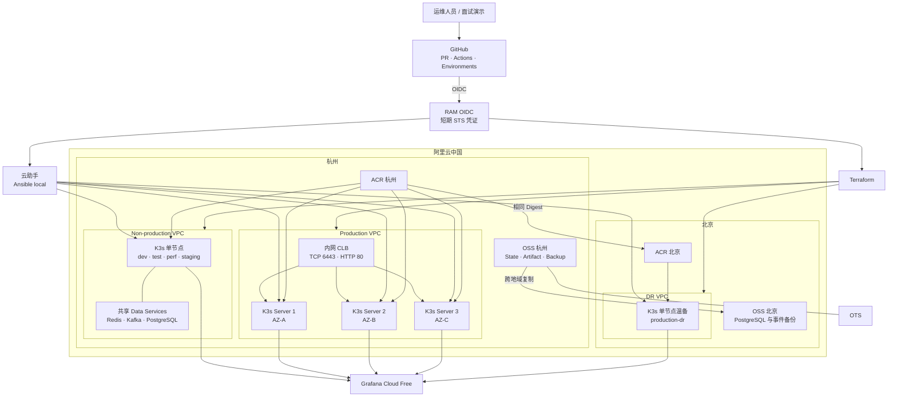
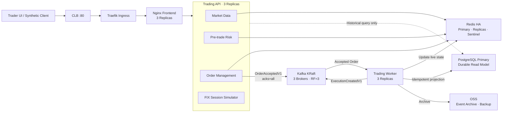
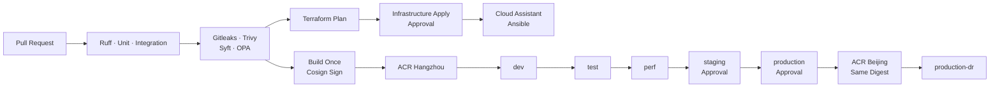
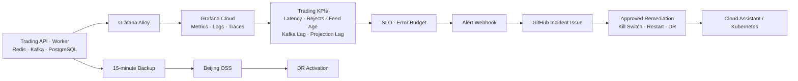

# GitHub + 阿里云中国 Trading System Distributed System 实施计划

> 保存目标：`docs/Plan-Trading-System.md`  
> 状态：执行中；本地应用、Kubernetes 清单、策略门禁、GitHub CI、镜像构建门禁、main 分支保护和 GitHub Environments 已完成，云资源与集群部署仍受凭据、成本和审批门禁约束。
> 执行过程中，任务状态同步到本文件。
> 验收基准：`/Users/xxseehome/Documents/sr-platform-engineer-test.pdf` 及附加 SRE、可观测性、GitOps、安全与分布式系统要求。  
> 定位：Low-Latency Trading Systems Production Operations Lab，不宣称真实交易所接入或纳秒级 HFT 性能。  
> 原文件 `docs/PLAN - General.md` 保持不变。

> 最近执行记录（2026-08-22）：合并 PR #2 后的 GitHub Actions [run 32572298472](https://github.com/xxseehome/distributed-trading-platform/actions/runs/32572298472) 已通过 Terraform fmt、validate、plan-only（隔离本地 backend）、Gitleaks、Trivy、Syft、OPA/Conftest、Ruff、pytest、Redis/Kafka/PostgreSQL service containers、Alembic/schema validation、API/前端构建、镜像扫描和 GHCR 推送。未创建云资源、未执行 Terraform apply 或 Kubernetes 部署。GitHub API 已创建 `infrastructure-plan`、`infrastructure-apply`、`dev`、`test`、`perf`、`staging`、`production`、`production-dr`、`dr-activate` 和 `destroy` 环境；apply、staging、production、production-dr、dr-activate、destroy 配置 `xxseehome` 为手动 reviewer，仅允许受保护分支，未触发任何工作流。现有 `terraform-plan`、`terraform-apply` RAM 角色未修改。

> 最近执行记录（2026-08-23）：PR #8 [run 32609932965](https://github.com/xxseehome/distributed-trading-platform/actions/runs/32609932965) 通过后已合并到 `main`；主分支 [run 32610037141](https://github.com/xxseehome/distributed-trading-platform/actions/runs/32610037141) 的 Contract/Worker integration、Terraform validation/plan-only、Gitleaks、Trivy filesystem/config、Syft、OPA/Conftest、Ruff、pytest 和 Build gate 全部通过。PR #8 将 Trivy config 扫描纳入发布依赖，补充了工作流 Environment/`terraform-apply` 策略测试，并为 Redis、Redis Sentinel、Kafka、PostgreSQL 和 topic Job 增加只读 root filesystem 与 scratch volume；未创建云资源、未执行 Terraform apply 或 Kubernetes 部署。Actions 的 Node.js 20 deprecation annotation 仍存在，但不影响结果。

> 最近执行记录（2026-08-23）：PR #9（Worker 去重、PostgreSQL 投影唯一性、依赖故障 readiness、offset 提交顺序）和 PR #10（手动推广前的同 SHA 成功 CI 前置校验）均已合并；主分支 [run 32611104192](https://github.com/xxseehome/distributed-trading-platform/actions/runs/32611104192) 全部通过。Alibaba CLI 只读盘点显示杭州当前仅有旧 `bookstore` 项目的 ECS/CLB，未发现本项目 trading 资源；未执行 Terraform apply、Kubernetes 部署或任何云资源创建。

## 1. 目标与总体架构

- [x] 使用 GitHub Public Repository、Pull Request 和 Actions 实施代码、变更和 CI 门禁管理；Environments 与审批边界已配置，实际云部署仍待凭据与人工批准。
- [ ] 使用阿里云中国 VPC、ECS、CLB、ACR、OSS、RAM OIDC 和云助手。
- [ ] 部署杭州 non-production、杭州 production、北京 DR 三个 K3s 集群。
- [ ] Production 使用三个跨可用区 K3s server，实现 control plane 和核心交易路径 HA。
- [x] 保留单一应用代码库和单一镜像，通过 Trading API 与 Worker 两种运行模式部署。
- [x] 使用 Redis 保存热数据，Kafka 保存可靠事件流，PostgreSQL 保存异步持久化投影。
- [x] PostgreSQL 不进入下单关键路径；数据库故障不阻塞新订单接收。
- [ ] Flux 管理平台资源，Argo CD 管理应用和数据服务。
- [ ] Grafana Cloud Free 实现 metrics、logs、traces、SLO 和告警。
- [ ] Splunk ITSI/SOAR 仅做能力映射，不宣称实际部署。
- [ ] 演示默认运行 4 小时、最多 8 小时，未抵扣费用硬上限为 ¥50。

### 云平台与三集群架构



### Trading System 应用架构



关键路径：

```text
Client
  → Trading API
  → Redis risk / idempotency / kill-switch check
  → Kafka acks=all
  → HTTP 202 Accepted
```

异步路径：

```text
Kafka
  → Trading Worker
  → Exchange execution simulation
  → Redis live status
  → PostgreSQL durable projection
  → OSS event archive
```

### CI/CD 与环境推广



### 可观测性、事件响应与 DR



- [x] 将 Mermaid 图同步到 `docs/architecture.md`。
- [ ] 将架构图导出为 PNG 并保存到 `docs/evidence/`。
- [x] 在文档中明确核心交易路径、异步投影路径和 PostgreSQL 非 HA 边界。

## 2. 应用、事件和数据模型

### 应用接口

- [x] 实现 `GET /healthz`，只验证当前进程存活。
- [x] 实现 `GET /readyz`，验证 Redis 和 Kafka；不因 PostgreSQL 不可用而移除 Trading API Pod。
- [x] 实现 `GET /api/market-data/{symbol}`，返回价格、时间戳和数据新鲜度。
- [x] 实现 `POST /api/orders`，要求 `Idempotency-Key`。
- [x] 订单请求包含 `account_id`、`client_order_id`、`symbol`、`side`、`quantity` 和 `limit_price`。
- [x] 合法订单在 Kafka `acks=all` 成功后返回 HTTP 202、`order_id` 和 `accepted`。
- [x] 相同幂等键和相同请求返回原结果，不重复创建订单。
- [x] 相同幂等键但请求内容不同返回 HTTP 409。
- [x] 风控拒绝返回 HTTP 422 和稳定的拒绝原因。
- [x] Kill switch 开启或关键依赖不可用时返回 HTTP 503。
- [x] 实现 `GET /api/orders/{order_id}`，优先读取 Redis，历史数据回退到 PostgreSQL；两级投影均不可用时返回明确 degraded/503。
- [x] 实现 `GET /api/positions/{account_id}`，读取 PostgreSQL 投影；数据库不可用时返回明确 degraded/503。
- [x] 实现 `GET /api/risk/status/{account_id}`，显示限制、当前使用量和 kill-switch 状态。
- [x] 实现受管理凭证保护的 `POST /api/admin/kill-switch`。
- [x] 移除 Catalog/Book Store 业务接口，不增加支付、用户、搜索或结算服务。

### Trading 逻辑

- [x] Market Data Simulator 生成有限 symbol 集合的确定性报价。
- [ ] 使用 Redis lease 保证多个 Worker 中只有一个活跃报价发布者。
- [x] Pre-trade Risk 检查最大单笔数量、最大订单名义金额和 kill switch。
- [x] OMS 使用 Redis 保存幂等键、活动订单和实时状态。
- [x] Exchange Simulator 消费接受事件并产生确定性成交结果。
- [ ] 模拟 FIX session ID、sequence number、heartbeat 和 gap 状态。
- [x] 不接入真实交易所，不增加 QuickFIX、专线、FPGA、DPDK 或内核旁路。
- [x] 所有价格与数量使用定点 Decimal，不使用浮点数处理订单金额。

### Kafka 事件契约

- [x] 创建 `orders.accepted.v1`、`orders.rejected.v1`、`executions.v1` 和 dead-letter topics。
- [x] `OrderAcceptedV1` 包含 `event_id`、`order_id`、`client_order_id`、`account_id`、`symbol`、`side`、`quantity`、`limit_price`、`occurred_at`、`trace_id` 和 `schema_version=1`。
- [x] `ExecutionCreatedV1` 包含 `event_id`、`execution_id`、`order_id`、`account_id`、`symbol`、`filled_quantity`、`execution_price`、`occurred_at`、`trace_id` 和 `schema_version=1`。
- [x] 使用 `order_id` 作为 Kafka message key。
- [x] Producer 启用 idempotence、`acks=all` 和有限重试。
- [x] Consumer 仅在 PostgreSQL 投影成功后提交 offset。
- [x] 使用 `event_id` 实现投影去重。
- [x] PostgreSQL 故障时不提交 offset，由 Kafka 保存 backlog，恢复后自动追平。

### PostgreSQL

- [x] 使用 PostgreSQL StatefulSet，不创建收费 RDS。
- [x] 使用 Alembic 管理 forward-only、向后兼容的数据库迁移。
- [x] 创建 `orders`、`executions`、`positions` 和 `processed_events` 表。
- [x] `processed_events.event_id` 使用唯一约束保证 exactly-once effect。
- [x] 价格和数量使用 `NUMERIC(18,8)`。
- [x] non-production 使用一个共享 PostgreSQL，并为 dev/test/perf/staging 使用独立 schema。
- [x] production 使用一个 PostgreSQL primary 和 5 GiB PVC。
- [ ] DR 使用一个可从北京 OSS 恢复的 PostgreSQL 实例。
- [ ] PostgreSQL 凭证只保存在 Kubernetes Secret，不进入 Git 或镜像。
- [x] PostgreSQL 只允许 Trading API 和 Worker 通过 NetworkPolicy 访问。
- [ ] 每 15 分钟执行压缩 `pg_dump` 并上传杭州 OSS。
- [ ] 备份跨地域复制到北京 OSS，并设置 7 天生命周期。
- [x] 不部署 Patroni、CloudNativePG、PostgreSQL Operator 或同步副本。

### PostgreSQL 故障边界

- [x] PostgreSQL 不参与风控、幂等和订单接受。
- [x] PostgreSQL 不可用时，Trading API 继续接受订单。
- [ ] PostgreSQL 不可用时，历史订单和持仓查询返回明确的 degraded 状态。
- [x] Worker 保持存活但停止提交 Kafka offset。
- [x] 数据库恢复后 Worker 自动排空 backlog 并恢复投影。
- [x] 文档明确 Production HA 不包含 PostgreSQL primary failover。

## 3. 基础设施与 GitOps

### 三集群配置

| 集群 | 初始规模 | 配置 |
|---|---:|---|
| non-production | 1 × 4 vCPU/8 GB | dev/test/perf/staging；共享 Redis、Kafka、PostgreSQL，通过 topic、consumer group、key prefix 和 schema 隔离 |
| production | 3 × 2 vCPU/4 GB，三个 AZ | embedded etcd、三副本 Trading API/Worker、Kafka KRaft、Redis Sentinel、单 PostgreSQL primary |
| DR | 1 × 2 vCPU/4 GB | 温备 K3s、相同镜像与 GitOps artifact，从北京 OSS 恢复 |

- [ ] 使用 Ubuntu 22.04、40 GB 系统盘和按流量公网出口。
- [ ] Production 节点必须来自杭州三个实际可用区；库存不足时停止创建。
- [ ] 安全组禁止长期公网入站，优先使用 ACR/OSS 内网 endpoint。
- [x] Trading API 和 Worker 在 Production 使用三副本。
- [x] 使用 Pod anti-affinity、topology spread 和 PDB。
- [x] 使用 `maxUnavailable: 0`、`maxSurge: 1` 和 startup/readiness/liveness probes。
- [x] 所有已渲染工作负载使用非 root、只读 root filesystem 和 requests/limits；数据服务的必要写入路径显式挂载 scratch volume（PR #8 / run `32610037141`）。
- [x] Kafka 使用三个 KRaft broker、RF=3 和 `min.insync.replicas=2`。
- [x] Redis 使用一主两从和三个 Sentinel。
- [x] PostgreSQL 使用单副本和独立 5 GiB PVC。
- [x] Kafka 每 broker PVC 设为 2 GiB，Redis 每实例 PVC 设为 1 GiB。
- [x] Kafka 保留期限制为 6 小时并设置日志大小上限。
- [ ] 节点磁盘在 70% 告警、85% 严重告警。
- [ ] 40 GB 系统盘仅在上述 PVC、镜像和日志上限生效后视为充足。
- [ ] 使用一个内网 CLB 提供 `TCP/6443` 和 `HTTP/80`。
- [ ] 默认通过 Workbench、云助手 synthetic check 和临时安全隧道验收。

### GitHub 与阿里云

- [x] 创建公开 monorepo `xxseehome/distributed-trading-platform`（默认分支 `main`）。
- [x] 配置 main 分支 PR、8 个 required checks、禁止 force push、禁止删除分支、管理员也须遵守保护规则，并要求线性历史和会话解决。
- [x] 创建 `infrastructure-plan`、`infrastructure-apply`、`dev`、`test`、`perf`、`staging`、`production`、`production-dr`、`dr-activate` 和 `destroy` Environments。
- [x] apply、staging、production、DR 和 destroy 已配置 `xxseehome` 为 required reviewer；当前账号是唯一仓库协作者，`prevent_self_review=false`，后续可添加第二位 reviewer。
- [x] 只有云访问 job 设置 `id-token: write`；PR #4 将 OIDC 权限收敛到 Terraform plan/apply 云访问 job，其他 job 不再继承该权限。
- [x] 复用现有 `github-actions` GitHub OIDC Provider；通过 RAM 角色信任策略复核其 issuer、audience 和 `xxseehome/*` repository 范围，未修改共享角色或权限。
- [ ] 不存在时创建独立 `github-actions-trading` Provider。
- [ ] 创建最小权限 `github-trading-plan`、`github-trading-apply` 和 `github-trading-ops` 角色。
- [ ] Trust Policy 限制到准确 repository 和 Environment subject。
- [x] GitHub 工作流使用 RAM OIDC 短期凭证，不保存长期 AccessKey。
- [ ] Terraform 使用 `foundation`、`primary` 和 `dr` 三个独立 state。
- [x] 使用私有 OSS backend 和 GitHub Actions concurrency；不创建额外锁表。该方案只串行化 GitHub Actions，外部 Terraform 命令仍必须人工避免并发。
- [ ] 所有资源使用 `Project`、`Owner`、`ManagedBy` 和 `ExpiresAt` 标签。

### Ansible 与 GitOps

- [ ] Actions 将固定版本 Ansible bundle 上传 OSS。
- [ ] 云助手下载并执行 `ansible-playbook -c local`。
- [ ] Playbook 安装并加固 K3s，配置 systemd、audit、registry mirror 和 Alloy。
- [ ] 第二次 Ansible 运行必须 `changed=0`。
- [ ] Flux 管理 namespaces、Ingress、Gatekeeper、Falco、Grafana Alloy 和 Argo CD。
- [ ] Argo CD 管理 Frontend、Trading API、Worker、Redis、Kafka 和 PostgreSQL。
- [ ] Flux 和 Argo CD 不得管理同一个 Kubernetes resource。
- [ ] 配置构建为 OCI artifact 并使用离线 Cosign key 签名。
- [ ] OCI artifact 推送到杭州和北京 ACR。
- [ ] Flux 使用仓库内公钥验证 artifact。
- [ ] 所有环境使用同一个不可变镜像 digest。

## 4. 流水线、安全与 SRE

### CI/CD

- [x] PR 阶段执行 Ruff、unit、integration、Gitleaks、Trivy filesystem/config、Syft 和 OPA/Conftest；Build gate 依赖全部门禁（PR #8/#9/#10 / main run `32611104192`）。
- [x] Integration 使用 Actions service containers 启动 Redis、Kafka 和 PostgreSQL（PR #2 / run `32572298472`）。
- [x] 执行 Alembic migration upgrade 和 schema validation（PR #2 / run `32572298472`）。
- [x] 执行 Terraform fmt、validate 和 plan-only（run `32558083862`，隔离本地 backend、`enable_apply=false`）；当前未增加 Terraform test 文件。
- [x] 保存不可变 Terraform plan artifact；`terraform-plan` 按 state 和 commit SHA 上传、保留 7 天的 `tfplan` artifact（PR #4）。
- [x] `infrastructure-apply` 审批后只 apply 已保存 plan；通过 `plan_run_id` 下载并定位经审核的 artifact，禁止重新 plan（PR #4）。
- [ ] 通过 Cloud Assistant 和 Ansible 配置节点。
- [x] 前端和后端镜像分别只构建一次并使用 Cosign 签名；手动推广要求提供同一 `main` commit 的成功 CI run ID，防止绕过安全门禁重新构建（PR #10）。
- [x] 按 `dev → test → perf → staging → production` 推广相同 digest。
- [ ] 相同 digest 复制到北京 ACR 并部署 production-dr。
- [ ] 数据库迁移必须向后兼容并在应用切换前执行。
- [x] 不允许环境重新构建镜像。

### OPA 与安全

- [x] 发布必须依赖测试、Gitleaks、Trivy filesystem/config、Syft 和 OPA；OPA 策略同时约束 Kubernetes apply 使用 Environment、Terraform apply 使用 `terraform-apply`（PR #8）。
- [x] staging、production、DR 和 destroy 部署/销毁工作流均使用对应 GitHub Environment；未触发实际云端部署。
- [x] Kubernetes 禁止 privileged、hostPath、root、latest tag 和无资源限制容器。
- [x] Production 必须满足副本、PDB、probe 和拓扑分布要求。
- [ ] PostgreSQL Secret 不得出现在 Git、日志、Terraform output 或 evidence 中。
- [ ] Kill switch 修改必须经过 production Environment 审批并记录审计事件。
- [ ] 使用 Trivy config 和 kube-bench 检查 CIS 基线。
- [ ] 使用 Falco 展示运行时安全告警。
- [ ] 五环境及 DR 必须使用相同 commit SHA 和镜像 digest。

### 可观测性

- [ ] 使用 Grafana Alloy、Grafana Cloud、Prometheus metrics、Loki logs 和 Tempo traces。
- [ ] 在 HTTP、Kafka event 和 Worker 投影之间传播 `trace_id`。
- [ ] 监控 order acceptance latency、error rate 和 risk rejection rate。
- [ ] 监控 market-data age、kill-switch 状态和 active orders。
- [ ] 监控 Kafka broker、under-replicated partitions、consumer lag 和 dead-letter 数量。
- [ ] 监控 Redis failover、memory、evictions 和 replication lag。
- [ ] 监控 PostgreSQL availability、connections、query latency、storage 和 projection lag。
- [ ] 建立 99.9% order-acceptance availability SLO。
- [ ] 在受控负载下设置内部 order acceptance p95 `<200 ms`、error rate `<1%`。
- [ ] 设置 Kafka-to-PostgreSQL projection lag `<30 s`。
- [ ] 外部 Web/API 演示 SLO 保持 p95 `<500 ms`。
- [ ] 建立 Error Budget、依赖图和 deployment SHA correlation。
- [ ] 文档明确这些是云端实验指标，不代表真实 HFT 延迟。

### 事件响应

- [ ] 告警触发 GitHub Incident workflow 并创建 Incident Issue。
- [ ] Incident 自动采集 ECS、K3s、版本、Kafka lag、Redis、PostgreSQL 和日志状态。
- [ ] 自动修复必须经过 production Environment 审批。
- [ ] 支持审批后的 kill-switch 启用与解除。
- [ ] 支持审批后的 Pod restart、consumer resume 和 DR activation。
- [ ] 将 KPI、事件关联、服务依赖映射到 Splunk ITSI。
- [ ] 将事件调查、审批和自动响应映射到 Splunk SOAR。
- [ ] 演示结束后撤销 Grafana 使用的细粒度 GitHub token。

## 5. DR、测试与验收

### DR

- [ ] 设置 RPO 15 分钟、RTO 60 分钟。
- [ ] 每 15 分钟上传 PostgreSQL dump 和最小事件恢复集到杭州 OSS。
- [ ] 将备份复制到北京 OSS。
- [ ] 每次 Production 发布后同步相同镜像和 OCI artifact 到北京 ACR。
- [ ] `dr-activate` 恢复 PostgreSQL、部署应用并验证接口。
- [ ] DR 为单节点温备，不宣称 HA。
- [ ] DR 不使用跨地域同步 PostgreSQL replication。

### 自动化测试

- [x] 测试 Decimal、订单校验、幂等键和 client order ID 冲突。
- [x] 测试最大数量、最大名义金额和 kill switch 风控规则。
- [x] 测试订单接受、拒绝、成交和状态转换。
- [x] 测试 Kafka 事件序列化、message key 和 schema version。
- [x] 测试 Worker event 去重和重复消费；重复 `event_id` 不重复写入投影。
- [x] 测试 PostgreSQL upsert 和 `processed_events` 唯一约束（CI PostgreSQL service container）。
- [x] 测试 Redis、Kafka 和 PostgreSQL 连通性（PR #2 / run `32572298472`）。
- [x] 测试 Redis/Kafka 故障时 Trading API readiness 返回 degraded/503 语义。
- [x] 测试 PostgreSQL 故障时 Trading API 仍可接受订单。
- [ ] 测试 PostgreSQL 恢复后 Kafka backlog 自动追平。
- [x] 测试 Worker 不会在投影或 execution publish 失败时提交 offset；提交发生在所有投影动作之后。
- [x] 通过 OPA/Conftest、Trivy config、SBOM 和主分支 CI 验证容器非 root、只读文件系统和安全门禁（PR #8 / main run `32611104192`）。
- [ ] 执行 Terraform、OPA、Ansible 和 GitOps 验证。
- [ ] 验证五环境和 DR 使用相同 digest。

### Production HA 验收

- [ ] 使用固定订单负载持续调用 Production。
- [ ] 停止任意一台 ECS 10 分钟。
- [ ] 验证 etcd 保持 2/3 quorum。
- [ ] 验证 Trading API 持续接受合法订单。
- [ ] 验证 Redis 自动选主。
- [ ] 验证 Kafka 在一个 broker 故障时继续写入。
- [ ] 验证 Trading API 和 Worker Pod 自动恢复。
- [ ] 如果故障节点承载 PostgreSQL，验证历史查询降级但订单接受继续。
- [ ] 恢复节点后确认 etcd、Redis、Kafka、应用副本和监控正常。
- [ ] 验证 PostgreSQL 恢复后 projection lag 回到目标范围。
- [ ] 保存 Actions、Grafana、Kubernetes 和接口结果证据。

### DR 验收

- [ ] 记录 Production 最后事件、订单和备份时间。
- [ ] 触发 `dr-activate`。
- [ ] 从北京 OSS 恢复 PostgreSQL。
- [ ] 使用北京 ACR 的相同 digest 启动应用。
- [ ] 验证 `/healthz`、`/readyz`、market data、下单、订单和持仓查询。
- [ ] 验证恢复点不超过 15 分钟、服务在 60 分钟内恢复。
- [ ] 保存 Actions、Grafana、Kubernetes、数据库和事件一致性证据。

## 6. 成本与退出

- [ ] 创建资源前检查“我的试用”、账单、库存和区域可用性。
- [ ] 保持旧 Online Book Store 资源不变。
- [ ] 计算五台 ECS、磁盘、CLB、ACR、OSS、OTS 和跨地域流量成本。
- [ ] PostgreSQL、Redis 和 Kafka 只作为 K3s 工作负载，不创建新的收费托管服务。
- [ ] 8 小时预计未抵扣成本 `≤¥50` 才允许创建。
- [ ] 超过 ¥50 时缩短为 4 小时；仍超限则停止 apply。
- [ ] 不通过降低 Production 三节点 HA 满足预算。
- [ ] 创建 ¥50 项目预算及 50%/80%/100% 告警。
- [ ] 演示后经 destroy Environment 审批删除项目云资源。
- [ ] 删除三个集群、ECS、CLB、磁盘、项目 ACR、OSS 数据和项目 RAM roles。
- [ ] 主资源删除后清理项目 OSS backend state。
- [ ] 保留共享旧 OIDC Provider，不删除。
- [ ] 保留 GitHub repository、计划、架构图和脱敏验收证据。
- [ ] 不保留 Terraform state。
- [ ] 确认最终零运行 ECS、零负载均衡、零遗留磁盘和零新增未抵扣费用。

## 7. 固定假设与边界

- GitLab 中国账号和 AWS.cn 个人免费试用不可用，实施路径固定为 GitHub 与阿里云中国。
- 当前工作区已初始化 Git 并关联公开远程仓库 `xxseehome/distributed-trading-platform`；云端资源与环境审批仍未配置。
- 三个集群均在阿里云中国：杭州 non-production、杭州 production、北京 DR。
- Production 固定使用三个 K3s server 和三个可用区。
- Production HA 范围包括 K3s control plane、Trading API、Worker、Redis 和 Kafka。
- PostgreSQL v1 为单 primary，不宣称数据库 HA。
- PostgreSQL 故障只影响历史查询和异步投影，不阻塞订单接受。
- 不使用 RDS、Patroni、CloudNativePG、PostgreSQL Operator 或 Longhorn。
- 应用保持单一代码库、单一后端镜像，通过 API 和 Worker 两种命令运行。
- 不拆分 Feed Handler、Risk、OMS、Gateway 和 Exchange 为独立微服务。
- FIX 只模拟会话语义，不建立真实 FIX 网络连接。
- 不宣称真实交易、真实交易所接入、纳秒级延迟或生产 HFT 性能。
- 40 GB 系统盘依赖严格的 Kafka retention、PVC 和日志容量限制。
- 免费额度不足时缩短演示时间，不降低 Production HA。
- 混合云和 on-prem 只做扩展架构说明，不宣称实际部署。
- GitHub Actions、RAM OIDC 和 Flux OCI reconciliation 作为 GitLab CI/CD 与 GitLab Agent 的替代实现。
- 浏览器仅用于登录、验证码、免费权益、首次 OIDC 和审批；其余操作优先使用 Codex、GitHub CLI/API 和 GitHub Actions。
- 创建资源前必须验证阿里云实时试用资格、价格和库存；不满足时停止并报告。
- 执行本计划时，云资源创建、GitHub 远程写入、应用部署和 Terraform apply 仍必须通过实时凭据、成本门禁与对应环境审批；未满足门禁时只做本地验证和文档更新。
