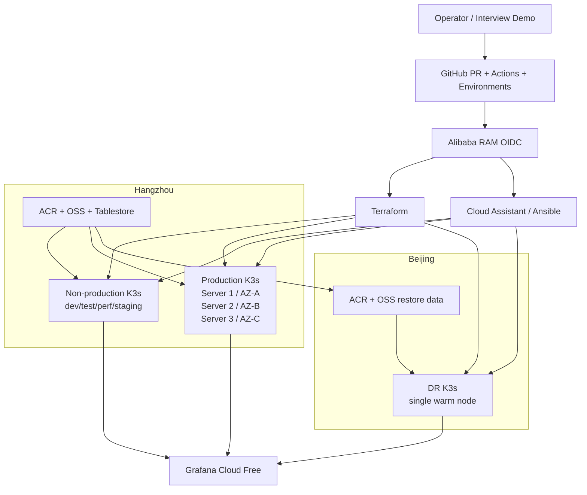
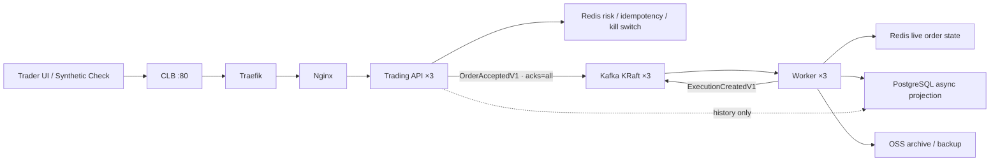
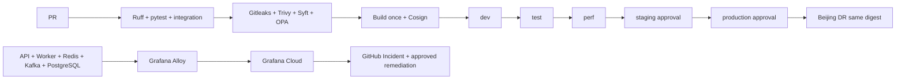
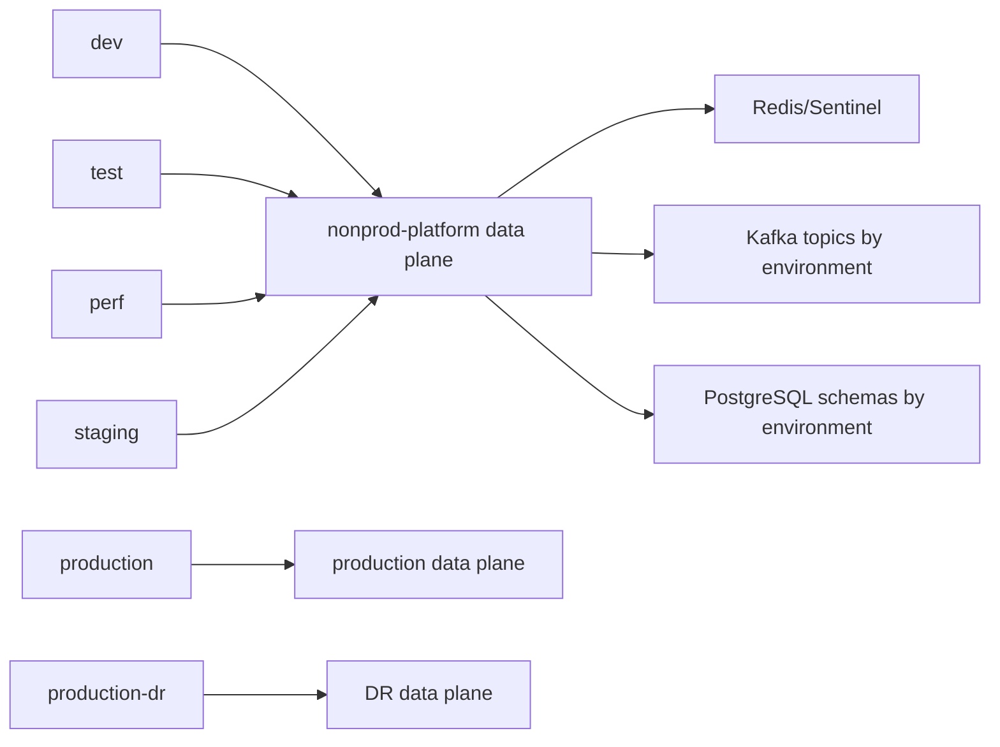

# Trading System Architecture

This document is the implementation view of
[`Plan-Trading-System.md`](Plan-Trading-System.md). It is intentionally explicit
about the PostgreSQL availability boundary: the order acceptance path is highly
available in Production, while PostgreSQL is a single asynchronous projection
primary in v1.

## Cloud and cluster topology

## Application and data flow

## Delivery and operations

## Environment and data-plane separation

The four non-production application namespaces (`dev`, `test`, `perf`, and
`staging`) share one low-cost data plane in `nonprod-platform`. Each application
namespace uses its own Kafka topic prefix and PostgreSQL schema; the shared
services do not imply shared order data. Production and DR each keep their data
plane in the cluster namespace. This keeps the three-cluster topology explicit
without creating four additional Kafka, Redis, or PostgreSQL installations.

The shared non-production data policy only permits the four application
namespaces and the topic-init Job to reach Redis, Sentinel, Kafka, and
PostgreSQL. Production still uses the stricter in-namespace policy. Credentials
are referenced as Kubernetes Secrets and are intentionally absent from Git.

## Availability boundary

| Component | Production target | Failure behavior |
|---|---|---|
| K3s control plane | 3 servers, 3 AZs | etcd keeps quorum after one server loss |
| Trading API | 3 replicas, spread across AZs | orders continue through another replica |
| Worker | 3 replicas, spread across AZs | Kafka consumer group rebalances |
| Kafka | 3 KRaft brokers, RF=3, min ISR=2 | accepted events remain durable |
| Redis | 1 primary, 2 replicas, 3 Sentinel | hot state fails over |
| PostgreSQL | 1 primary, 5 GiB PVC | history/projection degrades; orders continue; backlog drains after recovery |
| DR | Beijing single warm node | restored manually; no HA claim |

## Explicit non-goals

- No real exchange connectivity or FIX network session.
- No nanosecond HFT claim on general-purpose ECS/K3s.
- No Patroni, CloudNativePG, RDS, Longhorn or additional paid managed services.
- No new public ingress beyond the existing CLB demonstration boundary.
