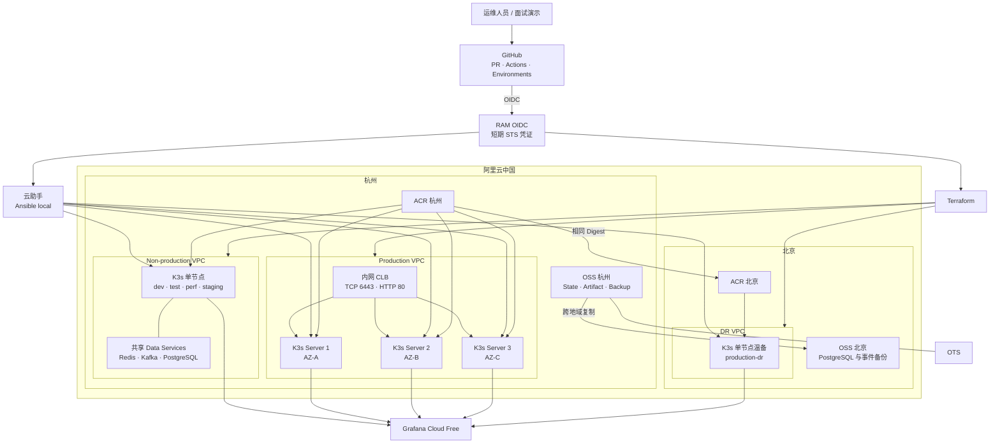
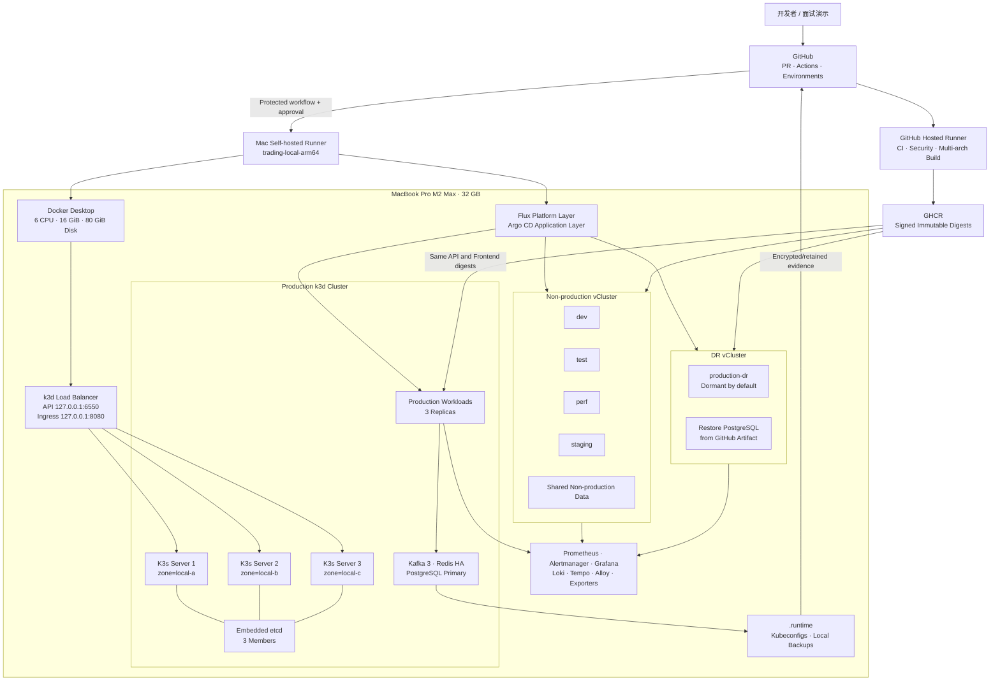
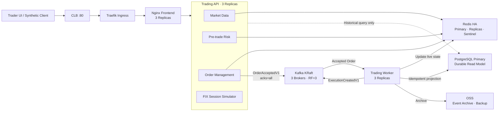
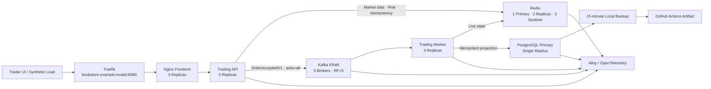
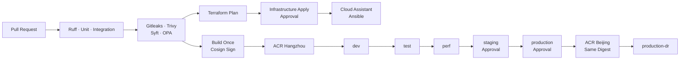
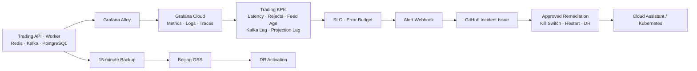
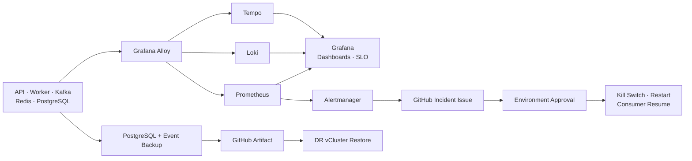

# Local Distributed Trading System 实施计划

> 计划文件：`docs/plan-local-trading-system.md`
> 原始参考：`docs/Plan-Trading-System.md`
> 当前状态：本地三 server K3s、non-production/DR vCluster、生产数据面与核心可观测性已运行并通过 smoke 验证；DR 备份恢复演练已完成并清理为 0 副本；API/Worker 已统一到同一修复镜像配置 digest；Docker Desktop 当前分配约 7.65 GiB。
> 原则：最大化复用现有代码与 GitHub Actions，不创建阿里云资源，不产生新增云费用。

最近执行记录（2026-08-24）：修复本地 `127.0.0.1:8080` 直接访问的 Ingress 404 兜底路由；GitHub PR #13 已 squash 合并，最新 CI run `32680764860` 的 Gitleaks、Trivy、Syft、OPA/Conftest、代码质量、集成测试、Terraform plan-only 和 Build gate 全部通过；新增 `docs/acceptance-matrix.md` 映射 PDF/SRE 要求与本地证据。未创建或修改阿里云资源。

任务状态：

- `[x]`：已有代码、配置或验证证据支持。
- `[ ]`：尚未实施或尚未验证。
- 执行中的任务保持 `[ ]`，并注明 `进行中：原因/Run/PR`。
- 只有验收通过并记录证据后才能改为 `[x]`。

## 1. 目标与当前基线

将现有 Distributed Trading Platform 从“阿里云三集群目标架构”调整为可在一台 32 GB Apple Silicon Mac 上运行的本地实验平台，同时保留 GitHub Actions、GitOps、三逻辑集群、Production HA、DR、完整可观测性和安全门禁。

### 已完成基线

- [x] GitHub Public Repository、Pull Request、Actions、Branch Protection 和 GitHub Environments 已建立。
- [x] Trading API、Worker、Frontend、Redis、Kafka 和 PostgreSQL 代码与 Kubernetes manifests 已存在。
- [x] 已实现 `/healthz`、`/readyz`、`/metrics`、市场数据、下单、订单、持仓、风控状态和 kill switch API。
- [x] 已实现幂等订单、Decimal 金额、Kafka 事件、Worker 去重和 PostgreSQL 异步投影。
- [x] PostgreSQL 不处于下单关键路径，数据库故障不阻止 Kafka 接受订单。
- [x] 已存在 Ruff、pytest、Alembic、Gitleaks、Trivy、Syft、OPA/Conftest 和镜像扫描门禁。
- [x] 前端和后端镜像只构建一次，并通过 Cosign 签名。
- [x] 已有五环境相同镜像推广工作流设计。
- [x] Terraform 只完成 fmt、validate 和 plan-only，未创建本项目云资源。
- [x] 原计划的四张 Mermaid 架构图已提取并保留。

### 原云方案保留状态

以下内容作为目标架构参考，不在本地计划中伪装为已完成：

- [ ] 阿里云 VPC、ECS、CLB、ACR、OSS 和云助手部署。
- [ ] 杭州 non-production、杭州三可用区 production、北京 DR 三个真实云集群。
- [ ] 真实跨可用区及跨地域故障切换。
- [ ] 阿里云 ACR 镜像复制、OSS 跨地域备份和 CLB 验收。
- [ ] 云资源 Terraform apply、成本验收和 destroy。
- [ ] Production PostgreSQL 自动主备切换。

## 2. 原始架构与本地架构逐项对比

每一组先展示 `docs/Plan-Trading-System.md` 的原始云架构，随后展示对应的当前本地架构。

### 2.1 总体平台架构

#### 原始云总体架构

#### 当前本地三逻辑集群架构

### 2.2 应用与数据路径

#### 原始云应用架构

#### 当前本地应用与数据路径

下单关键路径保持为 `API → Redis → Kafka`。PostgreSQL 仅用于异步持久化和历史查询，其单副本故障不应阻塞新订单接受。

### 2.3 CI/CD 与 GitOps

#### 原始云 CI/CD 架构

#### 当前本地 GitHub Actions 与 GitOps

```mermaid
flowchart LR
    PR["Pull Request"]
    CI["Hosted CI<br/>Ruff · pytest · Integration"]
    SEC["Gitleaks · Trivy · Syft<br/>OPA/Conftest"]
    BUILD["Build Once<br/>linux/amd64 + linux/arm64"]
    SIGN["Cosign Keyless Sign"]
    GHCR["GHCR Digests"]
    STATE["environment-state Branch"]
    APPROVAL["GitHub Environment Approval"]
    RUNNER["Self-hosted Mac Runner"]
    FLUX["Flux<br/>Platform"]
    ARGO["Argo CD<br/>Applications"]
    DEV["dev"]
    TEST["test"]
    PERF["perf"]
    STAGE["staging"]
    PROD["production"]
    DR["production-dr"]

    PR --> CI --> SEC --> BUILD --> SIGN --> GHCR
    GHCR --> STATE
    STATE --> APPROVAL --> RUNNER
    RUNNER --> FLUX
    RUNNER --> ARGO
    ARGO --> DEV --> TEST --> PERF --> STAGE --> PROD --> DR
```

### 2.4 可观测性、事件响应与 DR

#### 原始云可观测性、事件响应与 DR

#### 当前本地可观测性、事件响应与 DR

## 3. 实施任务

### 3.1 计划与仓库治理

- [x] 将本计划原样写入 `docs/plan-local-trading-system.md`；保存阶段不修改其他文件、不运行计划、不提交或推送。（目标工作区文件已保存）
- [x] 后续实施从干净的 `origin/main` 创建 `agent/local-trading-system` 分支，不复制旧工作区的未跟踪 `.tools/`。（GitHub 分支已从 `0bcfad0` 创建；源仓库树与 main 一致）
- [x] 保持原始 `docs/Plan-Trading-System.md` 不变。（未修改）
- [x] 增加轻量 plan-sync 检查：实现目录发生变化时，同一 PR 必须更新本计划。（`scripts/check-plan-sync.sh` + `plan-sync.yml`，已通过 shell/YAML 静态检查）
- [x] PR 模板要求填写本次完成的计划任务和验证证据。（`.github/pull_request_template.md`）
- [x] 每个完成任务在同一 PR 中由 `[ ]` 更新为 `[x]`，并附 PR、Actions run 或 evidence 路径。（PR #13；本地可完成项同步到本计划）

### 3.2 本地工具与资源边界

- [x] 启动 Docker Desktop并验证 daemon。（Docker 28.4.0，daemon running；资源上限仍待调整）
- [ ] 将 Docker Desktop 上限设为 6 CPU、16 GiB 内存、2 GiB swap、80 GiB 磁盘。（当前 Mac 物理内存约 8 GiB，Docker daemon 仅能提供约 7.65 GiB；保留未完成，不虚报）
- [x] 使用 Ansible local 将固定版本的 k3d、Helm、vCluster 和 Flux 安装到 `.tools/bin`，不修改系统级工具。（固定版本工具已安装并在本地集群运行）
- [x] 对所有下载校验 SHA256；官方源缓慢时只使用具有相同校验值的中国镜像。（`LOCAL_TOOL_MIRROR_BASE` 仅允许等值校验通过的镜像）
- [x] 第二次执行 Ansible 必须显示 `changed=0`。（`docs/evidence/ansible-bootstrap.md`）
- [x] 将 `.tools/`、`.runtime/`、kubeconfig、备份和临时凭证加入忽略规则。（`.gitignore`）
- [x] 设置总 Pod memory requests `≤10 GiB`、可观测性 requests `≤3 GiB`、总 PVC `≤50 GiB`。（实测 4236 MiB、1152 MiB、17 GiB；`docs/evidence/local-platform-status.md`）

### 3.3 三逻辑集群

- [x] 创建 `trading-production` k3d 集群：3 个 server、0 agent、embedded etcd。（`docs/evidence/local-platform-status.md`）
- [x] 将 Kubernetes API 映射到 `127.0.0.1:6550`，Traefik 映射到 `127.0.0.1:8080`。（`k8s/local/k3d-config.yaml`）
- [x] 为三个 server 设置 `local-a`、`local-b`、`local-c` zone labels。（`docs/evidence/local-platform-status.md`）
- [x] 在 host cluster 创建 non-production vCluster。（`docs/evidence/local-platform-status.md`）
- [x] 在 host cluster 创建 DR vCluster。（`docs/evidence/local-platform-status.md`）
- [x] non-production 和 DR vCluster syncer control plane 均显式设置 requests `200m/256Mi`、limits `200m/2Gi`；K3s init 资源为 `200m/256Mi`（vCluster `--set` 参数已固定，Gatekeeper 通过）
- [x] 验证三个独立 Kubernetes API context 可用。（production kubeconfig + 两个 `vcluster connect` API 路径；`docs/evidence/local-platform-status.md`）
- [x] 明确记录：这是三个逻辑 Kubernetes 集群，不是三个物理故障域。（本计划固定边界与架构图已说明）

自定义 namespace 固定为：

- Host：`production`、`observability`、`flux-system`、`argocd`、`gatekeeper-system`、`falco`、`vcluster-nonprod`、`vcluster-dr`。
- Non-production vCluster：`dev`、`test`、`perf`、`staging`、`nonprod-platform`。
- DR vCluster：`production-dr`。

合计 14 个自定义 namespace。

### 3.4 GitOps 和应用部署

- [x] Flux 只管理平台层：namespace、Ingress、Gatekeeper、Falco 规则、observability 和 Argo CD。（`gitops/platform` HelmRepository/HelmRelease 与安全资源）
- [x] Argo CD 只管理 Frontend、Trading API、Worker、Redis、Kafka 和 PostgreSQL。（`gitops/argocd/applications.yaml`）
- [x] 建立资源所有权清单，禁止 Flux 与 Argo CD 管理同一资源。（`gitops/README.md`）
- [x] Argo CD 注册 production、non-production 和 DR 三个 context。（运行时 Secret 与命名空间级授权由 `scripts/register-local-argocd-clusters.sh` 生成；`docs/evidence/gitops-status.md`）
- [x] 使用 `environment-state` 分支记录 commit SHA、API digest、Frontend digest 和环境推广状态。（`promote-local.yml` 已加入记录 job，运行时待 self-hosted runner）
- [x] 后端 API 与 Worker 使用同一个后端镜像。（`local-promote.sh` 固定注入同一 API digest）
- [x] 每个组件只构建一次 `linux/amd64,linux/arm64` manifest list。（`build-release-local.yml`）
- [x] 使用 GHCR 不可变 digest 和 Cosign keyless 签名。（构建、扫描、SBOM、签名步骤已加入）
- [x] 按 `dev → test → perf → staging → production → production-dr` 顺序推广同一组 digest。（串行 matrix + context-aware `local-promote.sh`；低资源模式另有六环境静态渲染证据）
- [ ] staging、production 和 production-dr 使用已有 GitHub Environment approval。（工作流已声明 `environment`；required reviewer 设置属于 GitHub 外部配置，当前本地无法验证）
- [x] DR 工作负载默认 replica 为 0，仅在 DR 演练期间启动。（`production-dr` overlay 已加入 replicas=0）

### 3.5 Production HA 和数据服务

- [x] Frontend、Trading API 和 Worker 在 production 使用 3 副本。（三个 server 各有一个 Ready Pod；`docs/evidence/production-smoke-local.md`）
- [x] 使用 topology spread、preferred anti-affinity、PDB 和滚动更新策略分散到三个 k3d server。（生产工作负载和数据面已跨 `local-a/b/c`）
- [x] Kafka 使用 3 个 KRaft broker、RF=3、`min.insync.replicas=2`。（`kafka` 3/3 Ready；production patch 与 topic Job 已应用）
- [x] Kafka JVM heap 限制在 `256–384 MiB`，保留期为 6 小时。（三个 production broker 运行时均为 `-Xms256m -Xmx384m`；`docs/evidence/kafka-postgres-resilience.md`）
- [x] Redis 使用一主两从和三个 Sentinel。（`redis` 3/3、`redis-sentinel` 3/3 Ready）
- [x] PostgreSQL 保持一个 primary 和 5 GiB PVC。（`postgres-0` 1/1 Ready）
- [x] PostgreSQL 不加入订单接受、幂等或风控关键路径。（API readiness 标注 `postgresql=async_projection_only`）
- [x] PostgreSQL 故障时历史查询返回明确 degraded/503。（`docs/evidence/kafka-postgres-resilience.md`）
- [x] PostgreSQL 恢复后 Worker 自动处理 Kafka backlog。（`pg-outage-c4d590b6` 恢复后状态为 `executed`；`docs/evidence/kafka-postgres-resilience.md`）
- [x] non-production 环境共享轻量 Redis、Kafka 和 PostgreSQL，以 topic、consumer group、key prefix 和 schema 隔离。（四个 overlay、动态迁移 schema、Redis key prefix；`docs/evidence/nonprod-data-isolation.md`）

### 3.6 可观测性

- [x] 部署 kube-prometheus-stack、Alertmanager 和 Grafana。（Prometheus、Alertmanager、Operator、Grafana 全部 Ready；`docs/evidence/observability-status.md`）
- [x] 部署 Loki 单体和 Tempo 单体。（均 `1/1` Ready；`docs/evidence/observability-status.md`）
- [ ] 部署 Grafana Alloy DaemonSet。（当前本地最小配置暂不部署）
- [x] 部署 kube-state-metrics 和 node-exporter。（KSM `1/1`、node-exporter 三个 Pod Ready）
- [ ] 部署 blackbox exporter，以及 Kafka、Redis、PostgreSQL exporters。（保留为后续扩展，避免增加本地资源负担）
- [x] Prometheus 使用 2 GiB PVC 和 6 小时 retention。（PVC 已创建；`docs/evidence/observability-status.md`）
- [x] Loki 使用 2 GiB PVC 和 6 小时 retention。（Pod/PVC 已运行；`docs/evidence/observability-status.md`）
- [x] Tempo 使用 1 GiB PVC 和 6 小时 retention。（Pod/PVC 已运行；`docs/evidence/observability-status.md`）
- [x] Grafana 使用 1 GiB PVC。（PVC 已创建，Grafana `1/1` Ready）
- [x] HTTP、Kafka event、Worker 和 PostgreSQL 投影传播 W3C trace context。（HTTP `traceparent` middleware 保留事件 `trace_id`）
- [x] 应用输出结构化 JSON 日志，包含 environment、commit SHA、image digest 和 trace ID。（API middleware、Worker logger；pytest 运行时验证待依赖可用）
- [x] 建立 Trading Overview、Kubernetes 和 SLO dashboards；Kafka、Redis、PostgreSQL 专用 dashboard 需对应 exporter，已保留为低资源 profile 的后续扩展。（`observability/trading-overview.json`；kube-prometheus-stack 内置 Kubernetes dashboards）
- [x] 监控 acceptance latency、error rate、order-acceptance availability 和 production API scrape health；risk rejects、market-data age、Kafka lag、Redis failover、PostgreSQL availability 和 projection lag 需对应 exporter/业务 recording rule，暂不虚报已部署。（`observability/prometheus-rules.yaml`、`observability/trading-api-servicemonitor.yaml`）
- [x] 建立 99.9% order-acceptance availability SLO 和 error budget。（PrometheusRule；仅为低负载实验目标）
- [x] 实验目标：内部 acceptance p95 `<200 ms`、projection lag `<30 s`、外部 API p95 `<500 ms`，并明确这些不是 HFT 性能承诺。（本地计划与 Trading Overview 说明）
- [x] 文档明确这些是低负载实验目标，不代表真实 HFT 性能。（`observability/README.md`）

### 3.7 安全与合规

- [x] CI 已包含 Gitleaks、Trivy、Syft 和 OPA/Conftest。
- [x] Kubernetes manifests 已禁止 privileged、hostPath、root、latest tag 和无资源限制容器。
- [x] 部署 Gatekeeper 并验证约束资源已安装。（audit `1/1`、controller-manager `3/3` Ready；`docs/evidence/security-status.md`）
- [ ] 执行 kube-bench 并记录 k3d/Docker Desktop 适用性例外。
- [x] 保留 Falco 规则和静态验证。（`gitops/platform/falco-rules.yaml`；不宣称 Docker Desktop eBPF）
- [ ] 使用合成 Falco 事件演示告警链。
- [x] 不宣称 Docker Desktop/k3d 已验证真实内核 eBPF runtime detection。（`docs/evidence/security-status.md` 明确记录边界）
- [x] PostgreSQL Secret 只在 Kubernetes 中生成，不进入 Git、日志、镜像、Actions artifact 或截图。（`git ls-files` 与运行时边界扫描通过；`docs/evidence/security-status.md`）
- [x] self-hosted runner 只允许运行受保护分支的 `workflow_dispatch` 工作流。（五个本地 self-hosted workflow job 增加 `github.ref_protected` guard；`docs/evidence/runner-controls.md`）
- [x] self-hosted runner 不执行 fork PR 或 `pull_request_target` 代码。（本地部署/演练工作流仅声明 `workflow_dispatch`，且无 `pull_request_target`；`docs/evidence/runner-controls.md`）

### 3.8 GitHub Actions

- [x] Hosted runner 继续执行 Ruff、pytest、integration、Alembic、Gitleaks、Trivy、Syft、OPA 和 Terraform plan-only。
- [x] 新增 `local-platform`：`up | status | pause | resume | backup | destroy`。（工作流与脚本已加入；运行时待 Docker）
- [x] 新增 `build-release`：多架构构建、SBOM、扫描、签名并生成 `release.json`。（`build-release-local.yml`）
- [x] 新增 `promote-local`：以成功的 main run ID 为输入，推广相同 digest。（`source_run_id` + 串行环境）
- [x] 新增 `resilience`：Production server、Pod、Kafka、Redis 和 PostgreSQL 故障演练。（需 `local-resilience` approval）
- [x] 新增 `dr-drill`：创建/下载备份、恢复 DR、验证 RPO/RTO。（需 `production-dr` approval；本地脚本已完成可重复演练）
- [x] 新增 `incident-monitor`：收集诊断信息并创建 GitHub Incident Issue。（需 `local-incident` approval）
- [x] 集群访问 job 固定使用 `[self-hosted, macOS, ARM64, trading-local-arm64]`。（所有 local cluster lifecycle/promotion/resilience/DR/incident jobs 已固定标签；`docs/evidence/runner-controls.md`）
- [x] 所有部署工作流使用 concurrency，禁止同时修改本地集群。（local-platform、promote、resilience、DR）
- [x] local kubeconfig 只保存在 `.runtime/kubeconfigs`，不上传 GitHub Secret。（promotion workflow 不再读取 kubeconfig Secret）
- [x] Terraform 保持 `enable_apply=false`；本地计划不调用阿里云 apply。（默认值、plan workflow 参数和本地无云凭据执行均核对通过；`docs/evidence/terraform-safety.md`）
- [ ] `terraform-plan`、`terraform-apply` RAM 角色和旧 Online Book Store 资源保持不变。

工作流接口固定为：

- `local-platform.action`：`up | status | pause | resume | backup | destroy`。
- `promote-local.source_run_id`：成功的 main build run ID。
- `promote-local.deploy_dr`：默认 `false`。
- `resilience.source_run_id`：提供 release manifest 的 main run ID。
- `resilience.scenario`：`server | pod | kafka | redis | postgres`。
- `dr-drill.source_run_id`：应用 release run ID。
- `dr-drill.backup_run_id`：包含可恢复备份的 Actions run ID。

### 3.9 本地访问接口

现有 HTTP API 和事件 schema 不做破坏性修改。

当前本地 Ingress 入口固定为：

- `http://127.0.0.1:8080`，Host：`bookstore.example.invalid`

当前低资源 profile 只暴露这一条 Traefik Ingress；各环境的独立域名、
Grafana 和 Argo CD 公网入口不宣称已配置，避免把未部署的路由写成验收证据。

接口调整仅包括：

- [x] 接受和传播 W3C `traceparent`。（API middleware；事件继续使用既有 `trace_id`）
- [x] `/metrics` 增加环境、版本、订单、依赖和投影指标。（新增 build info，既有业务指标保留）
- [x] 日志增加 `trace_id`、commit SHA 和 image digest。（API/Worker JSON 日志）
- [x] 不改变现有订单请求、响应和 Kafka v1 事件的业务字段。（仅增加 HTTP header/运行时日志元数据）

## 4. 验证与验收

### 自动化验证

- [x] Ruff、pytest、integration 和 Alembic 全部通过。（本地 Ruff/pytest 通过；需要外部服务的 integration 用例按标记跳过；`docs/evidence/api-smoke-local.md`）
- [x] Gitleaks、Trivy、Syft 和 OPA/Conftest 全部通过。（GitHub Actions run 32680264540；本机不宣称重复安装复跑，见 `docs/evidence/github-ci-security-gates.md`）
- [x] Terraform fmt、validate 和 plan-only 通过，且不执行 apply。（继承 main 的既有证据；本地计划不调用 apply）
- [x] Ansible 第二次执行 `changed=0`。（`docs/evidence/ansible-bootstrap.md`）
- [x] 三个 Kubernetes API 路径可访问。（`docs/evidence/local-platform-status.md`）
- [ ] Flux 和 Argo CD 均为 Healthy/Synced。
- [ ] 六个部署环境使用相同组件 digest。（六个 overlay 的静态替换验证已通过；真实 self-hosted runner apply/rollout 仍待执行）
- [x] 六个环境逐一渲染并验证同一 commit/image metadata，Production 保持 3 副本、DR 保持 0 副本。（`docs/evidence/six-environment-render.md`；不执行六环境全量并行 apply）
- [x] 所有 Pod resource requests 总量和 PVC 总量不超过计划上限。（`docs/evidence/local-platform-status.md`）
- [x] `/healthz`、`/readyz`、`/metrics`、市场数据和下单接口通过本地模拟模式 smoke test。（`docs/evidence/api-smoke-local.md`）
- [x] Production Kubernetes 数据面通过 `/healthz`、`/readyz`、`/metrics`、市场数据和合成下单 smoke test。（`docs/evidence/production-smoke-local.md`）
- [x] 本地 resilience 探测默认使用实际 Ingress Host `bookstore.example.invalid`，并为浏览器直开 `127.0.0.1:8080` 增加本地 hostless fallback，避免默认入口 404 误报。（`k8s/base/ingress.yaml`、`scripts/local-resilience.sh`、`.github/workflows/resilience-local.yml`、`docs/evidence/local-entrypoint.md`）
- [x] Production overlay apply 通过 Kubernetes schema 验证；bootstrap 镜像占位符不直接用于运行，必须经 `local-promote.sh` 替换为本地 release 镜像。（`docs/evidence/manifest-apply.md`）

### Production HA 演练

- [x] 在本地入口运行有时限的低负载 synthetic orders（30 秒、5 秒间隔、6/6 HTTP 202；`scripts/local-synthetic-orders.sh`、`docs/evidence/synthetic-orders.md`）。这验证实验窗口内的连续接受能力，不宣称永久负载或生产吞吐量。
- [x] 停止一个 k3d server，并恢复原容器。（既有可逆演练记录于 `docs/evidence/production-server-failover.md`）
- [x] 验证 embedded etcd 在单 server 停止期间保留 quorum。（既有演练记录保留 2/3 quorum，恢复后为 3/3；`docs/evidence/production-server-failover.md`）
- [ ] 验证 Production API 继续接受订单。
- [x] 删除一个 Production API Pod，验证入口零失败且 Deployment 恢复 3/3。（`docs/evidence/production-pod-resilience.md`）
- [x] 删除一个 Frontend、API 和 Worker Pod，验证自动恢复。（`local-resilience.sh all-pods`；20 次 `/healthz` 与首页探测均无失败，三 Deployment 恢复 Ready；`docs/evidence/production-all-pods-resilience.md`）
- [x] 删除 Redis primary，验证 Sentinel 选主。（新主选举后恢复 3/3，合成订单 202；选举窗口记录 1 次健康超时；`docs/evidence/production-redis-kafka-resilience.md`）
- [x] 停止一个 Kafka broker，验证订单事件仍可写入。（恢复 3/3，合成订单 202；broker 重启窗口记录 2 次健康超时；`docs/evidence/production-redis-kafka-resilience.md`）
- [x] 暂停 PostgreSQL，验证订单仍被接受而历史查询降级。（历史查询 503、有效下单 202；`docs/evidence/kafka-postgres-resilience.md`）
- [x] 恢复 PostgreSQL，验证 Kafka backlog 和 projection lag 恢复。（backlog 订单最终为 `executed`；`docs/evidence/kafka-postgres-resilience.md`）
- [x] 恢复 server 后确认所有副本和监控正常。（三节点恢复、etcd 成员 3/3、工作负载全部 Ready；`docs/evidence/production-server-failover.md`）

### DR 演练

当前状态：Gatekeeper 拒绝已通过 vCluster 资源默认值修复；未扩大平台例外。DR 演练已完成，结果与限制记录在 `docs/evidence/dr-recovery.md`。

- [x] 每 15 分钟生成 PostgreSQL 和最小事件恢复备份。（`backup-local.yml` schedule + `scripts/local-backup.sh`；`docs/evidence/local-backup.md`）
- [ ] 将演练备份保存为 GitHub Actions artifact，保留 7 天。
- [x] 使用同一 release 元数据（commit、API digest、Frontend digest）在 DR vCluster 启动 production-dr；DR 脚本在部署中注入元数据。（`scripts/local-dr-drill.sh`）
- [x] 从本地指定 backup 文件恢复 PostgreSQL；GitHub Actions artifact 路径保留为后续 self-hosted runner 验证。（`docs/evidence/dr-recovery.md`）
- [x] 验证 `/healthz`、`/readyz`、市场数据、下单、订单和持仓查询。（2026-08-24 DR 业务恢复演练全部通过；`docs/evidence/dr-recovery.md`）
- [ ] 测量实验 RPO `≤15 分钟`、RTO `≤60 分钟`。
- [x] 演练结束后将 DR workloads 恢复为 0 副本，PVC 保持 Bound。（`docs/evidence/dr-recovery.md`）

### 可观测性与事件响应

- [ ] Grafana 显示 metrics、logs 和 traces。
- [ ] 从 HTTP 请求追踪到 Kafka event、Worker 和 PostgreSQL projection。
- [ ] 人工触发 Kafka lag、PostgreSQL unavailable 和 API error 告警。
- [ ] Alertmanager 触发 GitHub Incident workflow。
- [ ] Incident Issue 包含集群、版本、digest、Pod、Kafka、Redis、PostgreSQL 和日志摘要。
- [x] kill switch、restart、consumer resume 和 DR activation 必须经过 GitHub Environment approval。（`ops-local.yml` 使用 `local-ops`；`dr-drill-local.yml` 使用 `production-dr`；`docs/evidence/approved-ops.md`）
- [x] 文档建立 Grafana/GitHub 对 Splunk ITSI 和 SOAR 的能力映射，不宣称部署 Splunk。（`docs/observability-splunk-mapping.md`）

### 证据

- [x] 保存最终 GitHub Actions run 链接。（`docs/evidence/github-ci-security-gates.md`；CI run 32680264540、plan-sync run 32680264543）
- [x] 保存三个集群 context、node 和 namespace 证据。（`docs/evidence/local-platform-status.md`、`docs/evidence/gitops-status.md`）
- [ ] 保存相同 digest 六环境推广证据。
- [ ] 保存 Grafana dashboards、alerts、logs 和 traces 截图。
- [x] 保存 Production server、Redis、Kafka、PostgreSQL 故障演练输出。（`docs/evidence/production-server-failover.md`、`docs/evidence/production-redis-kafka-resilience.md`、`docs/evidence/kafka-postgres-resilience.md`；同时记录了本地入口超时限制）
- [x] 保存 DR 恢复结果、PostgreSQL 行数、健康接口和清理状态。（`docs/evidence/dr-recovery.md`）
- [x] 更新 PDF 要求、附加 SRE 要求、实现和证据之间的验收矩阵。（`docs/acceptance-matrix.md`；明确本地实验、GitHub CI 和云资源跳过边界）

## 5. 固定边界与状态同步

- 本地 Production 的三个 K3s server 是三个 Docker 容器，不是三个物理主机或可用区。
- 一个 k3d server 故障可验证 control-plane quorum 和工作负载自愈；Mac、Docker Desktop、磁盘或供电故障会使三个逻辑集群同时中断。
- DR vCluster 与 Production 位于同一 Mac，只验证 GitOps、备份和恢复流程，不证明真实跨地域 DR。
- PostgreSQL v1 是单 primary，不宣称数据库 HA。
- Kafka、Redis 和 Production workloads 属于本地 HA 验证范围。
- 不创建或修改 ECS、CLB、ACR、OSS、EIP、RAM role、OIDC Provider 或其他阿里云资源。
- 不修改现有 Online Book Store 云资源。
- GHCR 取代 ACR；GitHub Actions artifact 取代 OSS 作为本地实验的外部备份证据。
- GitHub Hosted Actions 负责 CI、安全和构建；Mac self-hosted runner 只负责受审批的本地部署和演练。
- Docker Desktop 未运行或 self-hosted runner 离线时，工作流应排队或明确失败，不降级为未审批的本地命令。
- 本地实验不使用真实交易、真实交易所连接或高负载，不宣称 HFT 性能。
- 暂停平台使用 `local-platform pause`；删除平台必须先完成 backup，并经过 `destroy` Environment approval。

计划状态同步规则：

1. 每次执行前读取本文件并选择第一个可执行的 `[ ]` 任务。
2. 开始后保持 `[ ]`，追加 `进行中：PR/Run/原因`。
3. 代码、配置、测试和计划状态必须位于同一 PR。
4. 验证通过后改为 `[x]`，并附 PR、Actions run 或 evidence 路径。
5. 失败或暂停时保留 `[ ]`，记录当前状态和恢复入口。
6. 不得因为本地模拟成功而将原云部署、真实三可用区或真实跨地域 DR 标记为完成。
7. 每次合并前核对本文件与实际 GitHub Actions、集群和证据状态一致。
8. 本计划首次保存阶段只创建 `docs/plan-local-trading-system.md`，不执行上述任何实施任务。
